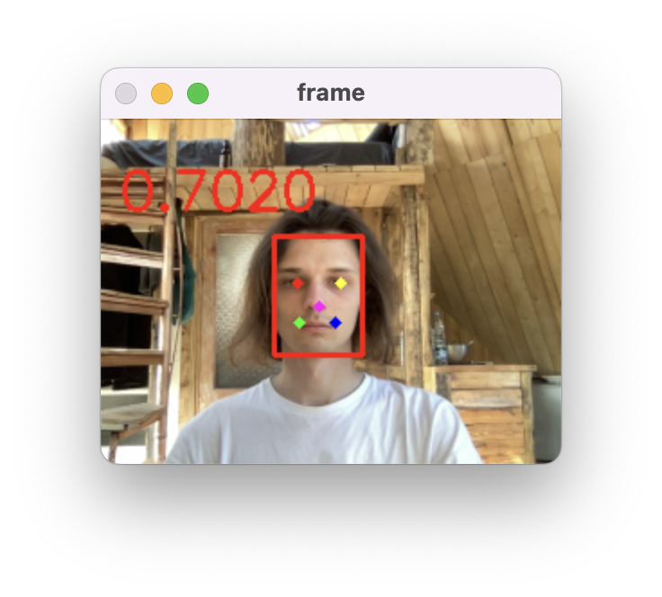
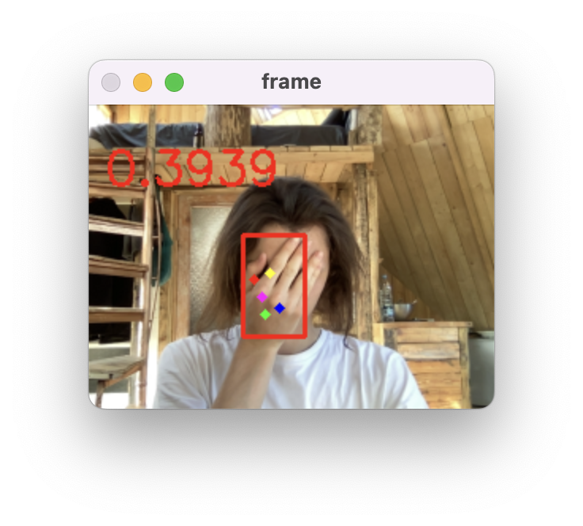

## Online Face Quality Prediction with CNN-FQ

Use the following script to create a window which displays camera input with quality scores and keypoints

``` Shell
python start.py
```


High quality             |  Low quality
:-------------------------:|:-------------------------:
  |  
